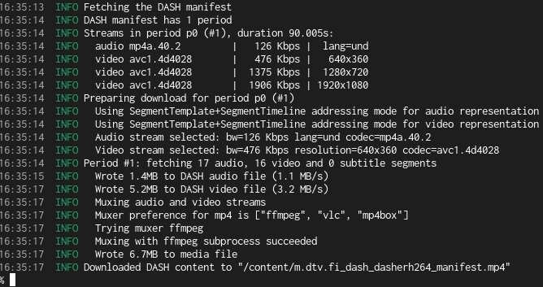
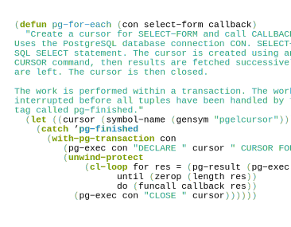

[dash-mpd-cli](dash-mpd-cli/) is a commandline tool that allows you to download media content that
is streamed using the DASH protocol. It allows you to archive video content from on-demand TV replay
service and video streaming services. It’s implemented in Rust and is available as a Podman/Docker
container for good software hygiene.

[PGmacs](pgmacs/) is an Emacs library that allows you to browse and edit data in a PostgreSQL
database. It works in both terminal mode and in graphical mode, on all platforms supported by Emacs.

The [pg-el library](pg-el/) provides an Emacs Lisp implementation of the PostgreSQL wire protocol.
It allows Emacs to query a PostgreSQL database on the local machine or over the network. It also
allows interaction with other databases that use the PostgreSQL wire protocol, such as CockroachDB,
CrateDB and QuestDB.

The [PSSH box tools implemented in WebAssembly](pssh-box-wasm/) allow you to decode and inspect a
PSSH box, to generate a Widevine PSSH based on user-provided fields including the key ID, and to
extract PSSH (DRM initialization) data from a media init segment. They are built as WASM and run
fully in your web browser.
